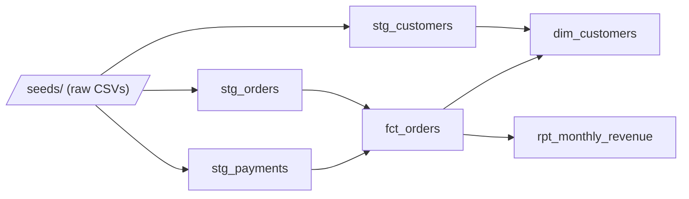

# dbt + Airflow + DuckDB — Data Engineering Mini-Proof

[](https://github.com/VMG-Emjan/dbt-airflow-duckdb-pipeline/actions/workflows/ci.yml)

A small, fully working analytics pipeline built with **dbt Core**, **Apache Airflow 3** and **DuckDB**, validated end-to-end by **GitHub Actions**. Everything runs on free, open-source tooling — no dbt Cloud, no managed Airflow, no paid warehouse, no API keys.

The goal is not a production system. It is a compact, verifiable demonstration of standard data engineering practice: layered models, data tests, orchestration, docs and CI.

## Stack

| Layer | Tool | Cost |
|---|---|---|
| Transformation | dbt Core 1.11 | free (OSS) |
| Warehouse | DuckDB (file-based) | free (OSS) |
| Orchestration | Apache Airflow 3.3 (DAG validated in CI) | free (OSS) |
| CI | GitHub Actions (public repo) | free |

## Pipeline



- **Staging** (`models/staging/`): typed, renamed views over the raw seeds.
- **Marts** (`models/marts/`): `fct_orders` (orders + payment totals), `dim_customers` (order history aggregates, lifetime value), `rpt_monthly_revenue` (monthly report).
- **Tests**: 22 dbt tests — `unique`, `not_null`, `accepted_values`, `relationships`, plus a singular test (`tests/assert_no_negative_order_totals.sql`).
- **Orchestration**: `dags/dbt_pipeline_dag.py` defines a linear Airflow DAG `dbt_seed → dbt_run → dbt_test → dbt_docs_generate`. CI validates the DAG imports cleanly and has the expected task order (`tests_dag/`).

## CI

Three independent jobs on every push and pull request:

1. **dbt build** — installs `dbt-duckdb`, runs `dbt seed / run / test / docs generate`, queries the built warehouse as a smoke test, and uploads the dbt docs (`index.html`, `catalog.json`, `manifest.json`) as an artifact.
2. **Airflow DAG validation** — installs Airflow 3.3 with the official constraints file (kept in a separate environment from dbt to avoid dependency conflicts) and runs `pytest` DagBag import tests.
3. **Lint** — `ruff check` over all Python.

## Run it locally

Requires Python 3.11+.

```bash
# dbt environment
python -m venv .venv
.venv/bin/pip install -r requirements-dbt.txt      # Windows: .venv\Scripts\pip

# build and test the warehouse
dbt seed --project-dir . --profiles-dir .
dbt run  --project-dir . --profiles-dir .
dbt test --project-dir . --profiles-dir .
dbt docs generate --project-dir . --profiles-dir .

# query the result
python scripts/query_warehouse.py
```

Airflow does not run natively on Windows; the DAG import tests run on Linux (locally or in CI):

```bash
pip install -r requirements-airflow.txt \
  -c https://raw.githubusercontent.com/apache/airflow/constraints-3.3.0/constraints-3.11.txt
pytest tests_dag/ -v
```

## Sample output

`python scripts/query_warehouse.py` after a build:

```
=== Monthly revenue report (rpt_monthly_revenue) ===
┌─────────────────────┬─────────────┬───────────────┬─────────────────┐
│    revenue_month    │ order_count │ total_revenue │ avg_order_value │
├─────────────────────┼─────────────┼───────────────┼─────────────────┤
│ 2025-02-01 00:00:00 │           4 │         276.5 │           69.13 │
│ 2025-03-01 00:00:00 │           5 │         578.0 │           115.6 │
│ 2025-04-01 00:00:00 │           5 │         504.0 │           100.8 │
│ 2025-05-01 00:00:00 │           4 │         532.0 │           133.0 │
│ 2025-06-01 00:00:00 │           3 │         166.0 │           55.33 │
└─────────────────────┴─────────────┴───────────────┴─────────────────┘

=== Top 5 customers by lifetime value (dim_customers) ===
┌─────────────┬──────────────┬─────────┬─────────────┬────────────────┐
│ customer_id │  full_name   │ country │ order_count │ lifetime_value │
├─────────────┼──────────────┼─────────┼─────────────┼────────────────┤
│           2 │ Burak Yilmaz │ TR      │           2 │          339.0 │
│          15 │ Omar Ali     │ UK      │           1 │          250.0 │
└─────────────┴──────────────┴─────────┴─────────────┴────────────────┘
```

## Proof checklist

- [x] `dbt seed` — 3 seeds loaded into DuckDB
- [x] `dbt run` — 6 models built (3 staging views, 3 mart tables)
- [x] `dbt test` — 22/22 tests pass
- [x] `dbt docs generate` — catalog + docs site produced (CI artifact)
- [x] Airflow DAG imports cleanly, correct task order, retries configured
- [x] Green GitHub Actions run (dbt build + DAG validation + lint)
- [x] Zero cost: no cloud services, no secrets, no API keys

## Cost note

This is a free / open-source proof by design. DuckDB replaces a paid warehouse; the same dbt project structure ports to Snowflake, BigQuery or Redshift by swapping the profile. Airflow is validated via CI DAG tests rather than a permanently deployed scheduler.

## Layout

```
├── dags/                 # Airflow DAG (dbt orchestration)
├── models/
│   ├── staging/          # views over raw seeds + schema tests
│   └── marts/            # fact / dimension / report tables + tests
├── seeds/                # raw CSV inputs
├── tests/                # singular dbt tests
├── tests_dag/            # pytest DagBag validation
├── scripts/              # warehouse smoke-test query
├── .github/workflows/    # CI pipeline
├── dbt_project.yml
├── profiles.yml          # DuckDB profile (no secrets)
├── requirements-dbt.txt
└── requirements-airflow.txt
```
